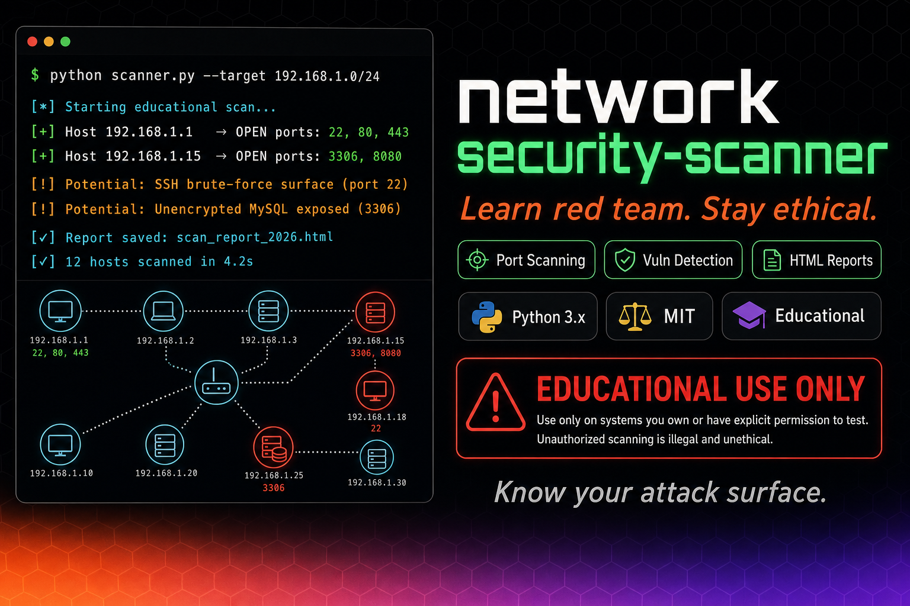

# Network Security Scanner

**Behavioral malware detection via network traffic analysis**

[](https://www.python.org/)
[](LICENSE)


**Qué es**: Scanner Python que detecta malware mediante análisis de comportamiento de tráfico de red (sin firmas estáticas). Identifica patrones sospechosos: port scanning, beaconing, data exfiltration.

**Diferenciador**: Detección basada en **comportamiento**, no en signatures. Detecta malware nuevo (0-day) si exhibe patrones conocidos.

---

## Por qué esto importa

**Problema**: Antivirus tradicionales (basados en firmas) fallan con malware nuevo o ofuscado.  
**Solución**: Detectar comportamientos sospechosos en tráfico de red:
- Port scanning (múltiples puertos en poco tiempo)
- Beaconing (conexiones periódicas a C&C servers)
- Data exfiltration (uploads grandes inusuales)
- DGA (Domain Generation Algorithms)

---

## Quick Start

### Requirements

- Python 3.10+
- Scapy (packet capture)
- Permisos root/sudo (para captura de paquetes)

### Setup

```bash
# Clonar
git clone https://github.com/drhiidden/network-security-scanner.git
cd network-security-scanner

# Instalar deps
pip install -r requirements.txt

# Ejecutar (requiere sudo para captura)
sudo python3 src/main.py --interface eth0 --duration 60

# Ver resultados
cat reports/scan_$(date +%Y%m%d).json
```

---

## Características

- **Behavioral Detection**: Port scanning, beaconing, exfiltration
- **Real-time Analysis**: Procesa paquetes en tiempo real con Scapy
- **Multi-threaded**: Captura y análisis en paralelo
- **Configurable Rules**: Umbrales ajustables por tipo de red
- **JSON Reports**: Exporta alertas con detalles (IPs, puertos, timestamps)
- **Low False Positives**: Filtros para servicios legítimos (DNS, HTTP)

---

## Detection Patterns

### 1. Port Scanning

```
Threshold: >10 puertos diferentes en <30s desde misma IP
Indicador: Reconnaissance phase de ataque
```

### 2. Beaconing (C&C Communication)

```
Threshold: Conexiones a misma IP externa cada X segundos (±10%)
Indicador: Malware reportando a Command & Control server
```

### 3. Data Exfiltration

```
Threshold: Upload >50MB en <5 min a IP no whitelisted
Indicador: Robo de datos
```

### 4. DGA Detection

```
Threshold: DNS queries a dominios aleatorios (>80% entropía)
Indicador: Malware generando dominios algorítmicamente
```

---

## Example Output

```json
{
  "timestamp": "2026-05-07T02:00:00Z",
  "alerts": [
    {
      "type": "port_scanning",
      "source_ip": "192.168.1.105",
      "target_ports": [22, 23, 80, 443, 3306, 8080, ...],
      "count": 15,
      "severity": "high"
    },
    {
      "type": "beaconing",
      "source_ip": "192.168.1.110",
      "destination_ip": "45.33.32.156",
      "interval": "60s ±5s",
      "count": 12,
      "severity": "critical"
    }
  ]
}
```

---

## Stack

Python 3.10+ · Scapy · argparse · JSON

---

## Documentación

- **[Detection Algorithms](docs/algorithms.md)** - Detalles de cada patrón
- **[Configuration](docs/config.md)** - Tuning de umbrales
- **[AGENTS.md](AGENTS.md)** - Setup técnico paso a paso
- **[CHANGELOG.md](CHANGELOG.md)** - Historial de versiones

---

## Roadmap

- **v0.2** (2 months): Machine learning para detección adaptativa
- **v0.3** (4 months): Dashboard en tiempo real (WebSocket)
- **v1.0** (6 months): Integration con SIEM (Splunk, ELK)

---

## Licencia

MIT - Ver [LICENSE](LICENSE)

---

**Metodología**: Desarrollado con [HCP (Human-Code-AI Protocol)](https://github.com/haletheia/human-code-ai-protocol)
